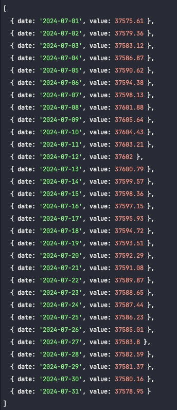

# Valor de la UF

Obteniendo un listado de valores de la UF para el mes actual, usando puppeter
directamente consultando la web del SII.

Resultado esperado:

;

## Requisitos

- Node.js (20 o superior)
- npm (9 o superior)

